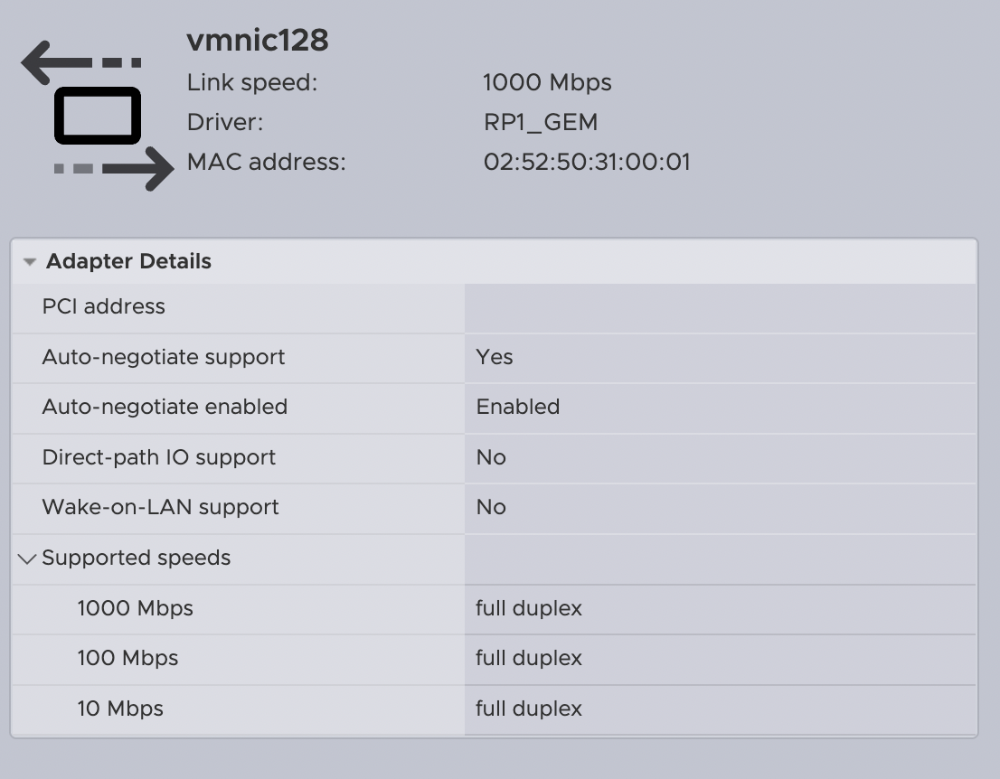

[English](README.md) | [Русский](README_RU.md) | [Releases](https://github.com/Soulveig/native-esxi-driver-bcm54213-rpi5/releases)

# Нативный драйвер ESXi для BCM54213 (Raspberry Pi 5)

Нативный сетевой драйвер VMware ESXi-Arm VMkernel для встроенного Ethernet
интерфейса Raspberry Pi 5.

> BCM54213PE — внешний Gigabit Ethernet PHY. Сам драйвер управляет Cadence GEM
> MAC в составе RP1 и взаимодействует с PHY через MDIO.

## Статус и совместимость

Версия **v0.214** проверена на хосте со следующей конфигурацией:

- Raspberry Pi 5;
- VMware ESXi-Arm 8.0U3c build 24449057 (`aarch64`);
- UEFI, предоставляющий Ethernet RP1 как ACPI `RPI0001`;
- PHY BCM54213PE;
- Ethernet 1 Гбит/с и MTU до 9000.



ESXi Host Client корректно показывает автосогласование и режимы
1000/100/10 Мбит/с Full Duplex. Снимок сделан на v0.211; в v0.214 эти
возможности не изменялись.

## Обязательный UEFI для Raspberry Pi 5

Для работы встроенного Ethernet необходим изменённый UEFI Raspberry Pi 5,
который предоставляет контроллер RP1 Cadence GEM системе ESXi как ACPI
`RPI0001`. Скачать прошивку и прочитать инструкцию по её установке можно здесь:

**[Soulveig/rpi5-uefi-soulveig-edition](https://github.com/Soulveig/rpi5-uefi-soulveig-edition)**

Штатная конфигурация UEFI может не предоставлять устройство в форме, требуемой
этим драйвером.

Это нативный uplink-драйвер VMkernel, а не Linux-драйвер, USB-эмуляция или PCI
passthrough. ESXi регистрирует интерфейс как физический uplink, обычно
`vmnic128`.

Проект не связан с VMware, Broadcom или Raspberry Pi Foundation и не
поддерживается ими. Не используйте драйвер в производственной среде.

## Возможности

- Нативный модуль ESXi VMkernel для ARM64.
- Привязка через ACPI `RPI0001`.
- Инициализация Cadence GEM MAC.
- Обнаружение BCM54213PE, MDIO, автосогласование и состояние линка.
- Регистрация физического uplink в VMkernel.
- Передача и приём пакетов через сетевой стек VMkernel.
- DMA-кольца дескрипторов и RX replacement buffers.
- Обычный MTU и jumbo frames до MTU 9000.
- Трафик самого ESXi и виртуальных машин.
- Установка через VIB или offline bundle.
- Восстановление после link down/up и диагностические счётчики.

## Архитектура и ограничения

- RX обслуживается polling world с интервалом 500 мкс.
- Общий IRQ RP1 **261 намеренно не регистрируется**, поскольку он также
  используется другими функциями RP1, включая USB-контроллеры.
- В v0.214 используется RX-кольцо на 32 элемента и TX batch 8.
- v0.214 ожидает завершения инициализации RX ring/DMA в polling world до
  публикации Link Up. После двух чистых тестовых перезагрузок RP1 management
  появился без ручного цикла `vmnic128 down/up`.
- v0.214 заменяет терминальное состояние TX watchdog на восстанавливаемый
  сброс очереди Cadence GEM, чтобы зависшая пачка не отключала TX навсегда.
- Wake-on-LAN не заявляется: в RP1 есть детектор magic packet, но платформа
  Raspberry Pi 5 не предоставляет полный путь пробуждения BCM2712 по Ethernet
  из выключенного состояния.
- VIB не подписан и имеет уровень `CommunitySupported`.
- Secure Boot должен быть отключён.
- Установка и удаление требуют maintenance mode и перезагрузки.
- Совместимость пока ограничена ESXi-Arm build 24449057.

## Измеренная скорость

| Тест | Результат |
|---|---:|
| TCP TX, jumbo MTU, 83,9 с | 257 Мбит/с |
| TCP RX, jumbo MTU, 600 с | 873 Мбит/с |
| TCP TX после `vmnic128` down/up | 343 Мбит/с |
| TCP RX после `vmnic128` down/up | 852 Мбит/с |
| Двунаправленный TX, 600 с | 361 Мбит/с |
| Двунаправленный RX, 600 с | 64,6 Мбит/с |
| ICMP jumbo payload 8972 | успешно |

При двунаправленной нагрузке оба направления конкурируют в текущей реализации
polling и очередей. Все 600-секундные тесты завершились с нулевыми RX/TX drops
и errors драйвера. Подробности приведены в
[docs/PERFORMANCE.md](docs/PERFORMANCE.md).

## Загрузка

Используйте последний раздел [Releases](https://github.com/Soulveig/native-esxi-driver-bcm54213-rpi5/releases):

- `rp1gem-0.0.214-1-offline-bundle.zip` — рекомендуемый offline depot;
- `rp1gem-0.0.214-1-community.vib` — отдельный VIB;
- `SHA256SUMS` — контрольные суммы.

## Установка

До окончания проверок оставьте USB-сетевую карту как management и аварийный
интерфейс. Рекомендуется доступ к локальной консоли. Не устанавливайте VIB
поверх старого вручную добавленного `rp1sys.v00`.

Перед установкой драйвера установите изменённый UEFI из проекта
[Soulveig/rpi5-uefi-soulveig-edition](https://github.com/Soulveig/rpi5-uefi-soulveig-edition).

1. Выключите или перенесите ВМ и включите maintenance mode.
2. Проверьте build ESXi 24449057 и убедитесь, что Secure Boot отключён.
3. Загрузите offline bundle в datastore.
4. Установите уровень acceptance:

```sh
esxcli software acceptance set --level CommunitySupported
```

5. Выполните dry-run:

```sh
esxcli software vib install \
  -d /vmfs/volumes/datastore1/rp1gem-0.0.214-1-offline-bundle.zip \
  --dry-run --no-sig-check --maintenance-mode
```

6. Если dry-run завершился без ошибок, установите пакет и перезагрузите хост:

```sh
esxcli software vib install \
  -d /vmfs/volumes/datastore1/rp1gem-0.0.214-1-offline-bundle.zip \
  --no-sig-check --maintenance-mode --no-live-install
sync
reboot
```

Полная процедура проверки и отката: [docs/INSTALL.md](docs/INSTALL.md).

## Исходный код и тестирование

Исходник находится в [src/rp1gem_mmio.c](src/rp1gem_mmio.c). Для сборки нужна
совместимая среда VMware/NDDK, а для упаковки — VMware `esximage` и payload
vmtar. Следуйте [docs/TESTING.md](docs/TESTING.md) и никогда не регистрируйте
общий IRQ 261.

Проект распространяется по лицензии [MIT](LICENSE).
